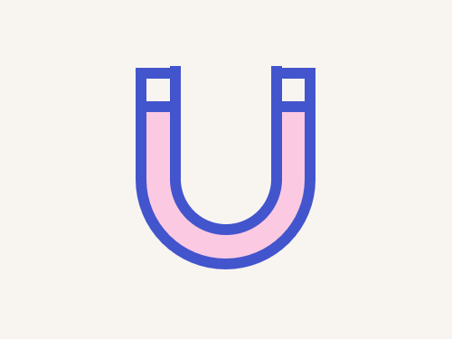

# Daily Target — Sep 30, 2026

Challenge: <https://cssbattle.dev/play/F8dyF0XEp3g1Ff4mG90c>

## Result

<table>
	<tr>
		<th width="50%">User Submission</th>
		<th width="50%">Target</th>
	</tr>
	<tr>
		<td width="50%" align="center">
			
		</td>
		<td width="50%" align="center">
			
		</td>
	</tr>
</table>

## Code

```html
<p a><p a b><p a b c><style>[a]{width:140;height:20;border:11q solid#4355CC;margin:60 112}[b]{height:130;background:#FCC9E3;margin:-70 112;border-radius:0 0 5pc 5pc}[c]{width:80;height:140;border-top:none;margin:-180 142}*,[c]{background:#F8F5F1
```
