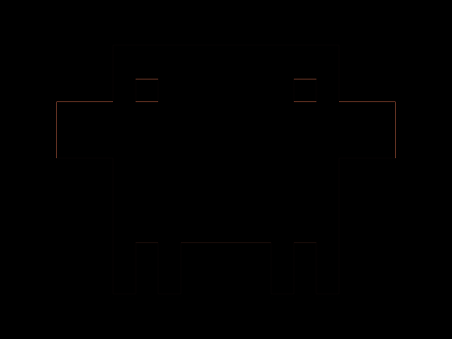

# Daily Target — Oct 2, 2026

Challenge: <https://cssbattle.dev/play/KX0Y2zNqhT7RlOsL0IRq>

## Result

<table>
	<tr>
		<th width="50%">User Submission</th>
		<th width="50%">Target</th>
	</tr>
	<tr>
		<td width="50%" align="center">
			
		</td>
		<td width="50%" align="center">
			
		</td>
	</tr>
</table>

## Code

```html
<p><p a><p b><p c><style>*,[c]{background:#141413}p{width:200;height:175;background:#D97757;color:#D97757;margin:40 92}[a],[b]{height:50}[c],[b]{width:20}[a]{width:300;margin:-165 42}[b]{margin:235 92;box-shadow:5ch 0,35vw 0,45vw 0}[c]{height:20;margin:-425 112;box-shadow:35vw 0#141413
```
