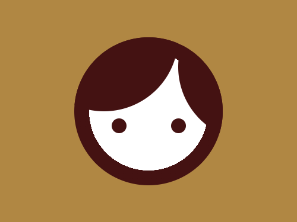

# Daily Target — Oct 3, 2026

Challenge: <https://cssbattle.dev/play/jIyS5tiYDKOTes7oiBMb>

## Result

<table>
	<tr>
		<th width="50%">User Submission</th>
		<th width="50%">Target</th>
	</tr>
	<tr>
		<td width="50%" align="center">
			
		</td>
		<td width="50%" align="center">
			
		</td>
	</tr>
</table>

## Code

```html
<div><p><p a><style>*{background:#B08743;width:200;height:200;border-radius:50%}p{background:#441212;color:#441212;margin:-100-60;box-shadow:50vw 5ch}[a]{width:20;height:20;margin:110 50;box-shadow:5pc 0}div{margin:50 92;overflow:hidden;background:radial-gradient(#fff 5pc,#441212 0
```
