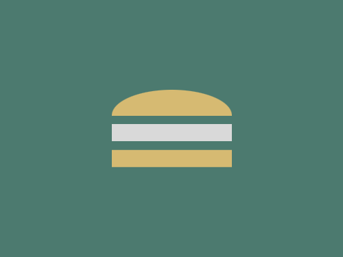
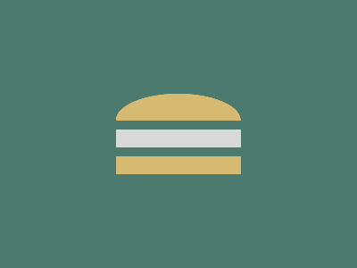

# Daily Target — Oct 4, 2026

Challenge: <https://cssbattle.dev/play/J10ALm0Yug1xXEdXhAHp>

## Result

<table>
	<tr>
		<th width="50%">User Submission</th>
		<th width="50%">Target</th>
	</tr>
	<tr>
		<td width="50%" align="center">
			
		</td>
		<td width="50%" align="center">
			
		</td>
	</tr>
</table>

## Code

```html
<p a><p><p b><style>*{background:#4C7A6F}[a]{height:60;background:#D6BA72;margin:105 122;border-radius:50%}p{width:140;height:40;margin:-135 122}[b]{height:20;background:#D9D9D9;margin:105 122;box-shadow:0 32q#D6BA72
```
