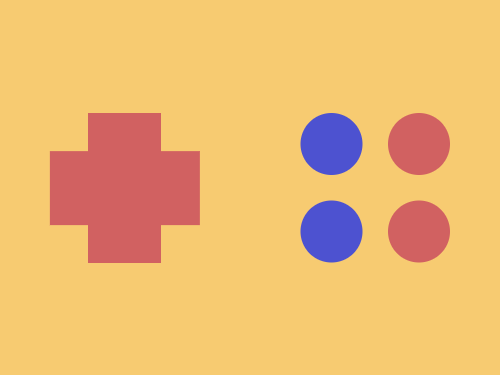
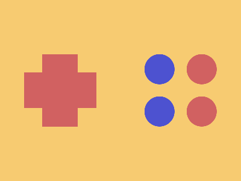

# Daily Target — Oct 5, 2026

Challenge: <https://cssbattle.dev/play/kKeIFq1dBXUmV9k1c7d0>

## Result

<table>
	<tr>
		<th width="50%">User Submission</th>
		<th width="50%">Target</th>
	</tr>
	<tr>
		<td width="50%" align="center">
			
		</td>
		<td width="50%" align="center">
			
		</td>
	</tr>
</table>

## Code

```html
<p>
<p a>
<p b>
<style>
  *{
    margin:0;
    position:fixed;
    background:#F7CB71;
  }
  p{
    width:59;
    height:120;
    background:#D16161;
    margin:90 70;
  }
  [a]{
    rotate:90deg;
    margin:90 70;
  }
  [b]{
    width:50;
    height:50;
    border-radius:50%;
    margin:90 310;
    box-shadow:-70px 0#4D52D0,0 70px#D16161,-70px 70px#4D52D0;
  }
</style>
```
