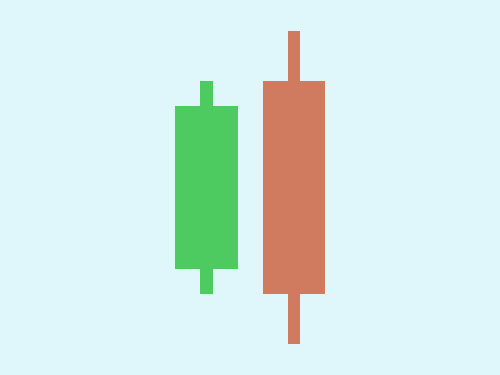

# Daily Target — Oct 9, 2026

Challenge: <https://cssbattle.dev/play/yzi0MYdpYpyHgy94qFCN>

## Result

<table>
	<tr>
		<th width="50%">User Submission</th>
		<th width="50%">Target</th>
	</tr>
	<tr>
		<td width="50%" align="center">
			
		</td>
		<td width="50%" align="center">
			
		</td>
	</tr>
</table>

## Code

```html
<p><p a><p a b><p b c><style>*{background:#DFF6FB}p{width:50;height:130;background:#4DCB60;margin:85 132}[a]{height:170;margin:-235 202;background:#D07B5F}[b]{width:10;height:250;margin:25 222}[c]{height:170;margin:-235 152
```
